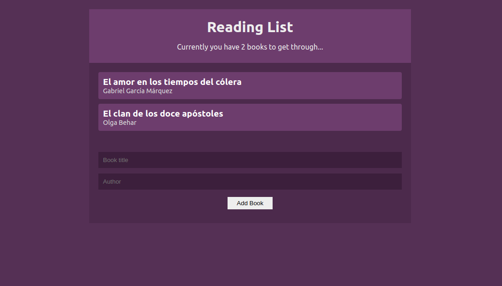

# React context API
This repository is a basic booklist, that allows add and remove data to the booklist. Additionally, allow to save booklist in local storage.

It's a basic example of how to use React Context API with functional components and also  how to implement Context API using a reducers.

## LIBRARIES

* React
* Create react app